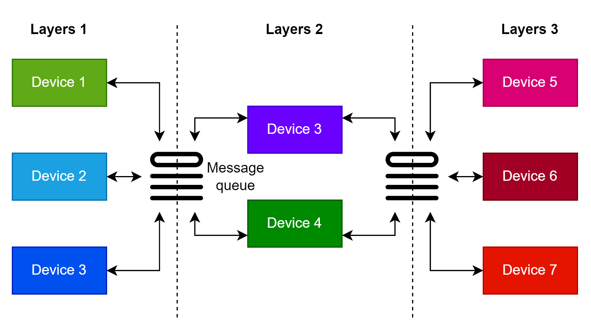

# Split Learning


**Split learning** is a method of distributed deep learning training, where a machine learning model is split into multiple parts and trained across multiple machines or devices without needing to share the full data or model. This ensures the security and privacy of data, particularly in applications requiring privacy protection such as healthcare, finance, or when devices lack the computational resources to train the full model.

### How Split Learning Works:
- **Model splitting**: The deep learning model is divided into two (or more) parts. For example, part of the model may run on the user device (edge device), while the rest runs on the server.
- **Communication process**:
  - The user device trains a portion of the model based on its local data or data from another device and sends the intermediate activations to the next layer's machine instead of sending the full data.
  - The clients at the last layers will calculate the backward pass and return the corresponding gradients to the user device to update the part of the model. This process repeats until the model completes training.
  - After completing a training round, the server receives the parameters from the clients and continues distributing the new model to the necessary clients for the next round.

### Advantages of Split Learning:
- **Privacy protection**: Sensitive data does not need to be fully transferred between devices and servers. Instead, only the intermediate activations are shared.
- **Resource-saving**: Devices with limited computational resources (such as mobile phones) can share the load and jointly train a smaller portion of the model compared to the original DNN.
- **Model scalability**: Split learning allows the model to be split across multiple devices, extending the capability to handle larger models.

## Deployment Model



## Required Packages
```
torch
torchvision
pika
tqdm
pyyaml
```

Set up a RabbitMQ server for message communication over the network environment. `docker-compose.yaml` file:

```yaml
version: '3'

services:
  rabbitmq:
    image: rabbitmq:management
    container_name: rabbitmq
    ports:
      - "5672:5672"   # RabbitMQ main port
      - "15672:15672" # Management UI
    environment:
      RABBITMQ_DEFAULT_USER: user
      RABBITMQ_DEFAULT_PASS: password
    volumes:
      - rabbitmq_data:/var/lib/rabbitmq
volumes:
  rabbitmq_data:
    driver: local
```

## Configuration

Application configuration is in the `config.yaml` file:

```yaml
name: Split Learning
server:   # server configuration
  num-round: 1  # number of training rounds
  clients:  # Layer 1 has 3 clients, layer 2 has 2 clients, layer 3 has 1 client
    - 3
    - 2
    - 1
  filename: resnet_model  # *.pth file name to be saved
  validation: True  # allow server to perform validation 

rabbit:   # RabbitMQ connection configuration
  address: 127.0.0.1    # address
  username: admin
  password: admin

learning:
  learning-rate: 0.01
  momentum: 1
  batch-size: 256
  control-count: 3    # control count on client
```

## How to Run

### Server
```commandline
python server.py
```

### Client

Note: In the same layer, clients are allowed to use duplicate IDs.

#### Layer 1
```commandline
python client_layers_1.py --id 1
```

```commandline
python client_layers_1.py --id 2
```

```commandline
python client_layers_1.py --id 3
```

#### Layer 2
```commandline
python client_layers_2.py --id 1
```
```commandline
python client_layers_2.py --id 2
```

## Parameter Files

On the server, the `*.pth` files are saved in the main execution directory of `server.py` after completing one training round.

If the `*.pth` file exists, the server will read the file and send the parameters to the clients. Otherwise, if the file does not exist, a new DNN model will be created with fresh parameters. Therefore, if you want to reset the training process, you should delete the `*.pth` files.

---

The application is under development...
