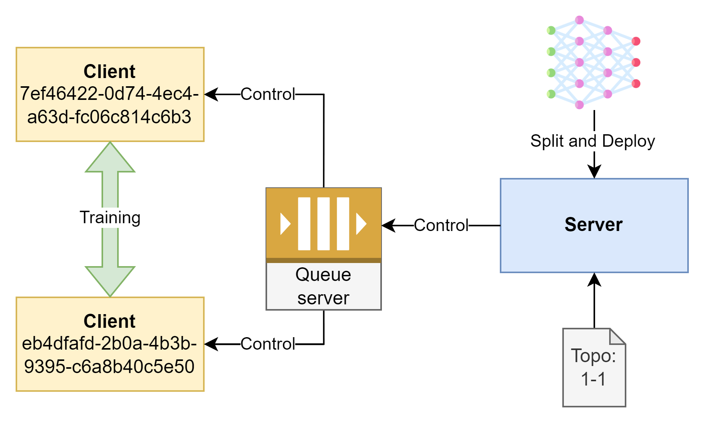

# Split Learning


**Split learning** is a method of distributed deep learning training, where a machine learning model is split into multiple parts and trained across multiple machines or devices without needing to share the full data or model. This ensures the security and privacy of data, particularly in applications requiring privacy protection such as healthcare, finance, or when devices lack the computational resources to train the full model.

### How Split Learning Works:
- **Model splitting**: The deep learning model is divided into two (or more) parts. For example, part of the model may run on the user device (edge device), while the controller function run on the server.
- **Communication process**:
  - The user device trains a portion of the model based on its local data or data from another device and sends the intermediate activations to the next layer's machine instead of sending the full data.
  - The clients at the last layers will calculate the backward pass and return the corresponding gradients to the user device to update the part of the model. This process repeats until the model completes training.
  - After completing a training round, the server receives the parameters from the clients and continues distributing the new model to the necessary clients for the next round.

### Advantages of Split Learning:
- **Privacy protection**: Sensitive data does not need to be fully transferred between devices and servers. Instead, only the intermediate activations are shared.
- **Resource-saving**: Devices with limited computational resources (such as mobile phones) can share the load and jointly train a smaller portion of the model compared to the original DNN.
- **Model scalability**: Split learning allows the model to be split across multiple devices, extending the capability to handle larger models.

## Deployment Model



To deploy the service, each blocks in the system (server and clients) need to ensure the following requirements:
- All must be successfully connected to the same queue server, which serves as the main communication hub for the entire system.
- The server must be correctly configured with the topology and the DNN model loaded.
- The clients must synchronize with each other when the model is split and joined according to the topology agreed upon with the server.

Clients training flow:


## Required Packages
```
torch
torchvision
pika
tqdm
pyyaml
```

Set up a RabbitMQ server for message communication over the network environment. `docker-compose.yaml` file:

```yaml
version: '3'

services:
  rabbitmq:
    image: rabbitmq:management
    container_name: rabbitmq
    ports:
      - "5672:5672"   # RabbitMQ main port
      - "15672:15672" # Management UI
    environment:
      RABBITMQ_DEFAULT_USER: user
      RABBITMQ_DEFAULT_PASS: password
    volumes:
      - rabbitmq_data:/var/lib/rabbitmq
volumes:
  rabbitmq_data:
    driver: local
```

Then run the RabbitMQ container

```commandline
docker-compose up -d
```

## Configuration

Application configuration is in the `config.yaml` file:

```yaml
name: Split Learning
server:  # server configuration
  local-round: 1 
  global-round: 1
  clients: # all devices in system
    - 2
    - 2 # layer 1 has 2 devices, layer 2 has 2 devices
  no-cluster: 
    cut-layers: [7] # general cut-point 
  cluster: 
    num-cluster: 1 # number of cluster
    cut-layers:
      - [7] # cut-point in cluster 0
      - [14] # cut-point in cluster 1
    infor-cluster:
      - [1,1] # cluster 0 has 1 device in layer 1 and 1 client in layer 2
      - [1,1] # cluster 1 has 1 device in layer 1 and 1 client in layer 2
  model: VGG16 # model name
  data-name: CIFAR10  # training data: MNIST, CIFAR10
  parameters:
    load: False  # allow to load parameters file
    save: False # allow to save parameters file
                # if turn on, server will be averaging all parameters
  validation: False # allow to validate on server-side
  data-distribution: # data distribution config
    num-label: 10 # number of label in dataset
    num-data-range: # minimum and maximum number of label's data
      - 250
      - 250
    non-iid-rate: 1 # non-IID rate, range (0, 1]
    refresh-each-round: True # if set True, non-IID on label will be reset on each round
  random-seed: 1
  client-cluster: # mode cluster configuration
    enable: False # run cluster
    auto-partition: False # use algorithm cluster
    syn-cut-layers: False 
    special: False # use mode only aggregate layer 1
    cluster: AffinityPropagation # choose cluster algorithm 
    AffinityPropagation: # cluster algorithm configuration
      damping: 0.9
      max_iter: 1000

rabbit: # RabbitMQ connection configuration
  address: 127.0.0.1
  username: admin
  password: admin
  virtual-host: \

log_path: .
debug_mode: True

learning:
  learning-rate: 0.01
  momentum: 0.5
  batch-size: 32
  control-count: 3
```

This configuration is use for server.

### List of DNN model

For `server.model` field:

```
VGG16
```

## How to Run

Alter your configuration, you need to run the server to listen and control the request from clients.

### Server

```commandline
python server.py
```

### Client

Now, when server is ready, run clients simultaneously with total number of client that you defined.

**Layer 1**

```commandline
python client.py --layer_id 1 --performance 0
```

Where:
- `--layer_id` is the ID index of client's layer, start from 1.
- `--performance` is the performance of device 
If you want to use a specific device configuration for the training process, declare it with the `--device` argument when running the command line:

```commandline
python client.py --layer_id 1 --performance 0 --device cpu
```

## Parameter Files

On the server, the `*.pth` files are saved in the main execution directory of `server.py` after completing one training round.

If the `*.pth` file exists, the server will read the file and send the parameters to the clients. Otherwise, if the file does not exist, a new DNN model will be created with fresh parameters. Therefore, if you want to reset the training process, you should delete the `*.pth` files.

---

## Setup Guide: RabbitMQ, Docker Compose, and Port Fix

---

### a) RabbitMQ Setup

#### 1. Check if RabbitMQ is installed
```bash
rabbitmqctl status
```

If you see:
```bash
bash: rabbitmqctl: command not found
```
→ RabbitMQ is not installed.

---

#### 2. Install RabbitMQ
```bash
sudo apt update
sudo apt install rabbitmq-server -y
```

---

#### 3. Start and enable RabbitMQ
```bash
sudo systemctl start rabbitmq-server
sudo systemctl enable rabbitmq-server
```

---

### b) Docker & Docker Compose

#### 1. Install Docker Compose
```bash
sudo apt update
sudo apt install docker-compose -y
```

---

#### 2. Add current user to Docker group
```bash
sudo usermod -aG docker $USER
```

---

#### 3. Reboot or restart your shell
```bash
reboot
```

---

#### 4. Test Docker
```bash
docker ps
```

If no error → Docker is working fine.

---

### c) Fix Port Conflict on 5672

#### 1. Check which process is using port 5672
```bash
sudo lsof -i :5672
```

---

#### 2. Kill the process (replace `<PID>` with the actual number)
```bash
sudo kill -9 <PID>
```

---

#### 3. Retry Docker Compose
```bash
docker-compose up -d
```
---

Version 3.0.0

The application is under development...

TODO:
- Inference mode and training mode
- Delete all queues alter finish
- Create close connection request
